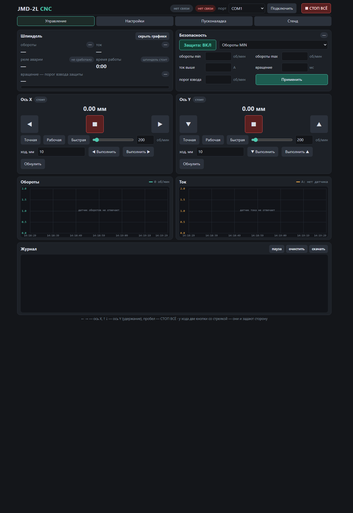

# JMD-2L CNC — панель управления мини-ЧПУ на Arduino

[](LICENSE)
[](docs/MANUAL.md)
[](firmware/jmd2l_cnc/jmd2l_cnc.ino)
[](CHANGELOG.md)
[](install/fetch-node.ps1)

Панель управления для мини-фрезерного станка **JET JMD-2L** (ход 750×200 мм) и
любого другого станка на шаговых двигателях с драйверами **DM542**.

Связь с платой — обычный USB как COM-порт, обмен текстом в ASCII по 115200 бод.
Панель открывается в браузере, программа ставится одним файлом и работает
полностью локально: после установки интернет не нужен.



---

## Что умеет

- **джог по осям X и Y** с клавиатуры и мышью, ход задаётся в миллиметрах;
- **обнуление** каждой оси отдельно, положение не теряется при закрытии панели;
- **защита от закусывания** шпинделя по току (ACS712) или по оборотам (тахометр):
  при заедании ножа ось встаёт, реле шпинделя выключается;
- **концевики** — четыре микровыключателя, назначаются любой стороной и любой
  полярности контакта;
- **аварии с причиной**: панель пишет в журнал не «ошибка», а что именно случилось
  — контакт замкнут, ток вне диапазона, обратная связь потеряна;
- **журнал в реальном времени**, хранится в браузере вместе с настройками;
- **стенд и 37 автопроверок**, которые проходят без подключённых моторов.

## Железо

| Что | Модель | Зачем |
|---|---|---|
| Плата | Arduino Nano v3.0 (ATmega328P) | прошивка и обмен с панелью |
| Драйверы шаговых двигателей | DM542 — 2 шт. | X и Y |
| Двигатели | 57HS76-2 (NEMA 23) — 2 шт. | |
| Датчик тока | ACS712-20A | защита от закусывания (A0) |
| Тахометр | щелевой фототранзистор + диск | второй метод защиты (D2, INT0) |
| Микровключатели | KW1-103-6 — 4 шт. | концевики X-1, X-2, Y-1, Y-2 |
| Реле | KY-019 | включение шпинделя (D13) |

Понадобится ещё драйвер CH340 — он ставится один раз, чтобы Windows увидела
плату как COM-порт.

## Быстрый старт

1. Скачайте репозиторий (**Code → Download ZIP**) и распакуйте в папку **без
   кириллицы в пути**.
2. Один раз, на машине с интернетом, положите внутрь Node.js:

   ```cmd
   powershell -ExecutionPolicy Bypass -File install\fetch-node.ps1
   ```

   Скрипт скачает Node.js 12.22.12 (18 МБ) и сверит контрольную сумму. Дальше
   интернет не нужен.

3. Запустите `install\install.cmd`. Он скопирует панель в
   `C:\Program Files\JMD-2L CNC`, положит свой Node.js и создаст ярлык
   **«JMD-2L CNC»** на рабочем столе.
4. Откройте ярлык. Панель поднимется на `http://localhost:8080`.

При первой установке из клона установщик сам поставит зависимости сервера —
одну библиотеку `serialport`. Это единственный момент, когда установщику нужен
интернет, и он уже есть с шага 2.

> Установщик просит повысить права и может показать окно «Разрешить этому
> приложению вносить изменения». Это нормально — он копирует файлы в Program
> Files. На Windows 7 может появиться SmartScreen: «Подробнее» → «Выполнить
> в любом случае».

### Не установлено, а надо посмотреть

```cmd
cd server
npm install
cd ..
start.cmd
```

Панель поднимется прямо из папки репозитория. Нужен Node.js в системе —
версии 12 и новее.

## Прошивка платы

Готовая прошивка лежит в репозитории:
[`firmware/prebuilt/jmd2l_cnc.ino.hex`](firmware/prebuilt/jmd2l_cnc.ino.hex) —
она собрана из [`jmd2l_cnc.ino`](firmware/jmd2l_cnc/jmd2l_cnc.ino) этого же
репозитория, так что можно и просто её залить, и править исходник.

Чтобы **залить готовую** прошивку, нужен `avrdude` — он входит в Arduino IDE.
Сама IDE при этом не запускается, скрипт берёт `avrdude.exe` из её папки сам:

```cmd
powershell -ExecutionPolicy Bypass -File bench\flash.ps1 -Port COM4 -SkipBuild -BuildPath firmware\prebuilt
```

Признак успеха — строка `N bytes of flash verified` в конце. Код возврата
`avrdude` местами бывает равен 1 даже при успешной заливке, судите по строке.

Ключ `-SkipBuild` означает «не компилировать», поэтому `arduino-cli` и
компилятор не нужны. Интернет тоже не нужен.

Подробности, ручной сброс RESET и что делать, если плата не видна —
[§7 руководства](docs/MANUAL.md).

> **Про Arduino IDE.** В репозитории её нет и она не нужна для сборки. Нужна
> ровно одна вещь — `avrdude`. Поставьте Arduino IDE 1.8.19 (на Windows 7 версия
> 2.x не запускается вовсе) и повторите команду выше. Установщик из готовой
> поставки, наоборот, везёт `avrdude` с собой — тогда IDE не нужна совсем.

### Сборка прошивки из исходников

Исходник — один файл, без внешних библиотек. Чтобы его собирать, нужен
компилятор — а он в IDE и есть:

```cmd
powershell -ExecutionPolicy Bypass -File bench\flash.ps1 -Port COM4
```

Скрипт найдёт `arduino-cli` и `avrdude` в папке установленной IDE сам. Если не
найдёт — укажите пути ключами `-Cli` и `-Avrdude`.

Положить комплект инструментов рядом с программой, чтобы она работала вообще
без IDE, можно одним скриптом:

```powershell
powershell -ExecutionPolicy Bypass -File install\fetch-arduino.ps1
```

Скрипт берёт `arduino-cli`, компилятор `avr-gcc`, ядро AVR и `avrdude` из
установленной у вас Arduino IDE (номера версий подставляет сам) и складывает их
в `install\payload\arduino`, 333 МБ. Дальше `flash.ps1` находит их рядом с
собой.

Если ничего собирать не хочется — правьте и заливайте через Arduino IDE,
[§7.5 руководства](docs/MANUAL.md).

## Подключение

Пины Arduino Nano — коротко, подробно в [приложении А руководства](docs/MANUAL.md):

| Пин | Куда |
|---|---|
| D9 / D8 / D7 | PUL / DIR / ENA драйвера X |
| D6 / D5 / D11 | PUL / DIR / ENA драйвера Y |
| D3, D4 | концевики X-1, X-2 |
| D10, D12 | концевики Y-1, Y-2 |
| A0 | выход ACS712 |
| D2 | тахометр (INT0) |
| D13 | реле шпинделя |

Общий провод GND обязателен: плата, драйверы и питание датчиков должны быть
связаны по земле. ENA у DM542 включён по **LOW** — это уже учтено в прошивке.

> **Про полярность концевика.** По умолчанию включён нормально **замкнутый**
> контакт. Если у вас микровыключатель с нормально разомкнутым — это другой
> режим, включается в настройках панели. Оба варианта описаны в
> [§5.4 и §5.5 руководства](docs/MANUAL.md).

## Что дальше — по порядку

1. **Проверить монтаж** — [§6 руководства](docs/MANUAL.md): без станка и моторов.
2. **Выставить настройки** — [§10](docs/MANUAL.md): микрометры на оборот важнее
   всего, остальное берётся из паспорта двигателя и DIP-переключателей.
3. **Провести пусконаладку** — вкладка «Пусконаладка» панели, устройство шага в
   [SPEC §5.3](docs/SPEC.md).
4. **Подстраховаться** — [§5.2 руководства](docs/MANUAL.md): ограничитель
   скорости и кнопка аварийного останова. Для фрезерного станка это не
   формальность.

## Стенд и автотесты

```powershell
powershell -ExecutionPolicy Bypass -File bench\jmd2l_test.ps1 -Port COM4 -ShortRunSec 20
```

37 проверок протокола: концы хода, ровно нулевой датчик, движение в пределах,
блокировка по цепочке безопасности, сброс аварий. Моторов не требуется — всё
проходит на столе, станок при этом двигать нельзя.

> Перед автотестами и любыми стендовыми прогонами прочитайте
> [§15.2](docs/MANUAL.md): у стенда есть ограничения по скорости и длине хода,
> и их нельзя обходить.

## Документация

| Файл | О чём |
|---|---|
| [docs/MANUAL.md](docs/MANUAL.md) | руководство оператора: 17 глав, от монтажа до диагностики |
| [docs/JMD-2L CNC - Руководство.docx](docs/JMD-2L%20CNC%20-%20Руководство.docx) | то же самое в Word, для печати и раздатки |
| [docs/SPEC.md](docs/SPEC.md) | что система должна и чего не должна делать |
| [CONTEXT.md](CONTEXT.md) | предметная область: термины, границы, открытые вопросы |
| [docs/adr/](docs/adr) | почему так: три записи о ключевых решениях |
| [CHANGELOG.md](CHANGELOG.md) | что менялось и почему, включая невыясненные вопросы |

## Как устроено

```
firmware/jmd2l_cnc/jmd2l_cnc.ino   прошивка платы: разбор ASCII, таймеры, защита
firmware/prebuilt/                  готовая прошивка .hex — прошить без сборки
server/server.js                    сервер: serialport, REST, поток событий SSE
web/                                панель: пять вкладок на обычном JavaScript
install/install.cmd                 установщик для Windows 7–11
install/fetch-node.ps1              разовый разбор Node.js внутрь комплекта
install/fetch-arduino.ps1           разовый разбор инструментов прошивки
bench/flash.ps1                     собрать и прошить одним скриптом
bench/jmd2l_test.ps1                37 автопроверок протокола
start.cmd                           запустить панель из папки репозитория
```

Сервер — один файл на `serialport` 10 и встроенных модулях Node, фронтенд —
без сборки и без фреймворков. Обновление панели не требует ничего, кроме
перезапуска.

## Чего система пока не проверела

Честно, чтобы не было сюрпризов. Подробности — в
[разделе «Известные невыясненные вопросы»](CHANGELOG.md).

- Проект проходил проверку на столе, **не на собранном станке**. Путь
  «панель → плата → драйвер → ось» на живой машине не прогонялся.
- Известный случай: при заданной частоте 9913 шаг/с ось едет примерно вдвое
  медленнее. Ход при этом верный, причина не найдена — [§17.6](docs/MANUAL.md).
- На Windows 7 ставится Node.js 12.22.12 — последняя версия с официальной
  поддержкой этой системы. Обновлений безопасности в ней не будет, это осознанный
  компромисс. На Windows 10 и 11 Node можно заменить на любой свежий.

## Хотите дописать

Отлично. Форк, своя ветка, pull request — всё это обычные права MIT.
Порядок работы, подписи коммитов по-русски и что стоит прочитать перед
изменениями — в [CONTRIBUTING.md](CONTRIBUTING.md).

Правки прошивки, которые задевают безопасность станка, проходят проверку
`bench\jmd2l_test.ps1`: 37 из 37 должны быть зелёными.

## Лицензия

MIT — [LICENSE](LICENSE). Можно использовать, менять и продавать, сохранив
уведомление об авторском праве.

Зависимость одна: [`serialport`](https://www.npmjs.com/package/serialport) 10.x
(Node.js), MIT. Прошивка использует только ядро Arduino AVR.